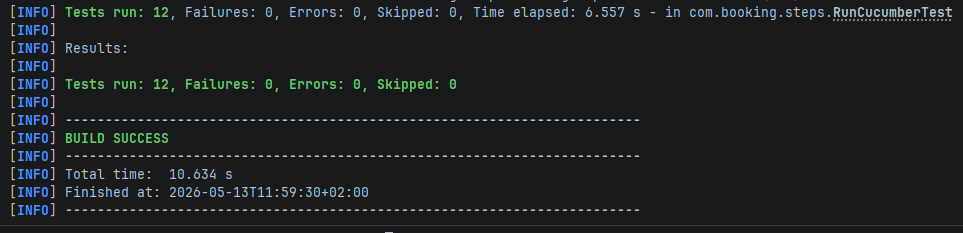

# Booking API Tests

API tests for the restful-booker platform, written by Rémy Ishimwe.
Make it clean :-)

## Stack

- Java 17
- REST Assured
- Cucumber
- JUnit 4

## How to run

```bash
mvn test
```

## What's covered

- Authentication (valid/invalid credentials)
- Health check
- Create booking (happy path + validation)
- Get, update, delete booking (authenticated and unauthenticated)

## Notes

The API resets every 10 minutes so tests create their own data before each scenario.
Unauthenticated scenarios assert the response is not 200 since the exact error code isn't documented.

## Test results



## Favorites
@Then("the API status is UP")
assertThat(response.jsonPath().getString("status"), equalToIgnoringCase("UP"));
